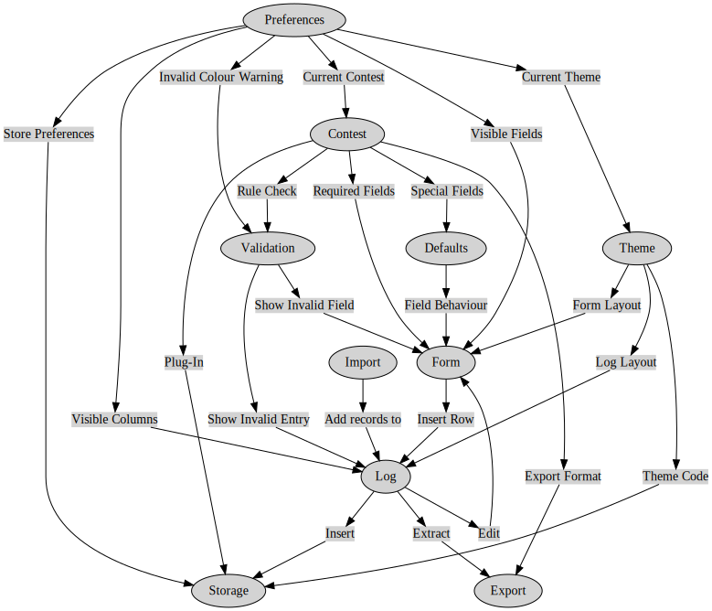

# Contesting Software

Amateur Radio contesting is an activity where hobbyists get on air, exchange information and log the exchange. A contest awards points for such an exchange using rules defined by the contest manager.

# Current Project Status

A Minimum Viable Product (MVP), is [being developed](https://github.com/vk6flab/contest-logger/tree/pre-alpha) in a separate branch to act as a demonstration, one step above drawing on a piece of paper. You should not rely on it to accurately do anything. If you find issues, please let me know, but understand that this is NOT the actual product, it's the first pass at exploring what kinds of issues will need to be resolved when implementing an open source, cross-platform contest logging solution.

When complete it will have the following functionality:

- [x] Form with basic logging fields
- [x] Table with log entries
- [x] Example of a Preferences screen
- [x] Log current time
- [x] Local storage of current log
- [x] Log export to file
- [x] Example of a validation error
- [x] Switching between two layout style sheets
- [ ] Installable PWA

---

# What is this project?

There are many tools that provide various levels of contest logging. I have tried most, if not all of them. Whilst I have used several of them for serious contesting, I've always found that they didn't meet my expectations. In order to progress this area of Amateur Radio, I started putting together a list of requirements for my ideal solution. At this time there are no tools that provide the following functionality.

## Environmental Requirements

These sections describe the environment in which this tool is intended to operate.

### Open Source
- must be open source and the code must be available to the entire community. There are too many stories of great tools dying or being held hostage by individuals or small groups. The tool should continue to exist and be usable regardless of the participation of the original developer. Users should be able to fix things, add functionality, change themes, whatever.

### Cross Platform
- must be cross platform, as-in, you should be able to use it on whatever computer you have access to, a Linux workstation, a Macintosh Laptop, an Android Phone or tablet, Windows, iOS and a Raspberry Pi. In other words, there shouldn't be a situation where you cannot run the tool because you have some random combination of operating system or CPU that the developer doesn't support.

### Usable Offline
- must be usable without needing to be connected to the internet during the contest.

### Updates
- must provide an update mechanism.
- updates must not be forced on the user.

## Functionality Requirements

These sections describe what type of contesting functionality the tool should have.

### Customisation
- must have the ability to add contest rules, using a versioned plug-in system that can be authored by novice programmers or contest managers.
- plug-ins must be shareable by the user.
- must be extensible. Not every contest requires the same information. For example, the John Moyle Memorial Field Day, a contest run every year during March in Australia requires that VHF and UHF contacts record the maidenhead locator, a four or six character message that designates the location of the station. This is used to calculate distance between two stations and award points accordingly. Such a requirement isn't needed in most other contests.

### Live Validation
- must support live validation be able to show if a contact if valid by whatever means the rules for a particular contest decide.

### Exports
- must export data in whatever format the contest organiser accepts.
- must export entire log set for backup and takeout purposes using an open standard.

### Partial Callsign Validation
- should support the super check partial list to validate partial callsigns.
- should provide an API for other validation lists.

## User Interface Requirements

These sections describe the requirements for user experience.

### User Interface
- user must be able to set a preferred layout using a style sheet that can be shared.
- must be able to disable fields in such a way that the field is visible, but not required for a successful log entry.
- must respect users already defined system settings such as:
  - dark mode
  - date format
- fields must be able to have a default value
- fields should be able to be hidden and data entry should skip hidden fields.

### Accessibility
- must honour user preferred input method and be able to use that to complete all the common contesting data entry.
- must be able to use keyboard or mouse, or both.
- must not require crazy keyboard shortcuts, unless specified by the user, in other words, the tool needs to be able to get out of the way of the user.

### Editing Contacts
- must provide a mechanism to edit a contact after it has been logged.

### Contact History
- must track previous entries and present data from previous contacts.
- must store all contacts ever made.

### Automatic Time Logging
- must automatically log time with the ability to manually override.
- logging must be in UTC.

### Imports
- should be able to import existing logs so you can start to consolidate older logs.

---

# Proof Of Concept

The following projects and examples were explored to establish that the basic functionality can be built with a Progressive Web App.

- [x] Progressive Web App
  - https://github.com/ibrahima92/pwa-with-vanilla-js
- [x] Minimal CSS
  - https://github.com/picocss/pico
  - https://github.com/dohliam/dropin-minimal-css
  - https://github.com/longsien/BareCSS
  - https://design-system.service.gov.uk/
  - https://news.ycombinator.com/item?id=29559961
  - https://web.dev/building-a-theme-switch-component/
- [x] Dynamic Tables
  - https://datatables.net/examples/api/tabs_and_scrolling.html
- [x] External File Handling
  - https://github.com/GoogleChromeLabs/text-editor.git
- [x] Table Row Handling
  - https://www.javaguides.net/2020/11/javascript-crud-example-tutorial.html
- [x] Tabs in CSS
  - https://alvarotrigo.com/blog/html-css-tabs/
- [x] Default Values
  - https://www.w3schools.com/tags/att_input_value.asp
  - https://www.w3schools.com/jsref/prop_text_defaultvalue.asp

---

# System Design

- [ ] user intentions
- [ ] the functional blocks of the environment
- [ ] messages between blocks
- [x] GraphViz representation
  - See [design.dot](design.dot)

---
To visualise the relationship between the various components a first pass at component relationships has been constructed. This is not exhaustive, likely contains logical errors and has not been implemented in the MVP version at all.

---

# Implementation Design

- [ ] TBD

---

This is an Open Source project, on purpose. The idea is that it's your project to contribute to in what ever way works for you. You can email me <cq@vk6flab.com>, or create an issue, better still, make a pull-request.

Look forward to your ideas!

73, de Onno VK6FLAB
